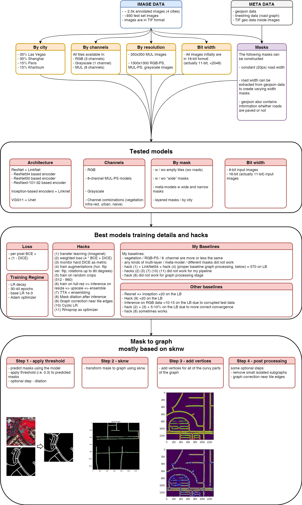

This is solution for the SpaceNet three challenge as submitted to be checked by the Topcoder team.
This will give you some information about TopCoder platform.

**More stuff from us**
- [Telegram](https://t.me/snakers4) 
- [Twitter](https://twitter.com/AlexanderVeysov)
- [Blog](https://spark-in.me/tag/data-science)

# 1 Hardware requirements

**Training**

- 6+ core modern CPU (Xeon, i7) for fast image pre-processing;
- The models were trained on 2 * GeForce 1080 Ti;
- Training time on my setup ~ **3 hours** for models with 8-bit images as inputs;
- Disk space - ~30GB should be more than enough for the Docker image + files;
- The dataset weighs ~100-150 GB and is copied, so make some room;

**Inference**

- 6+ core modern CPU (Xeon, i7) for fast image pre-processing;
- On 2 * GeForce 1080 Ti inference takes **3-5 minutes**;
- Graph creation takes **5-10 minutes**;

# 2 Following the Topcoder requirements

Data [download guide](https://drive.google.com/open?id=1WJh8Q1Oj38Ahn0FiwUv1WZXoIwnY08_kL4XO8cikPo0) from the authors.

Final [testing guide](https://drive.google.com/open?id=1maGeUSaoqSYjFUzQ2S1IKyMSjzlZ5GWs) from the authors.

**Steps to reproduce the result as per the guide:**

- You can clone the repository to see the code for yourself `git clone REPO_URL .`;

- Download the `.zip` [file](https://drive.google.com/file/d/1rQD1-s1JCaFcgaQ9rn9OUTc4BKOaznN-/view) to some folder;

-  Download the [Dockerfile](https://drive.google.com/file/d/1rQD1-s1JCaFcgaQ9rn9OUTc4BKOaznN-/view) to the same folder;

- Building and running the container (assuming [nvidia-docker2](https://github.com/NVIDIA/nvidia-docker)):

`docker build -t aveysov .`

`docker run --runtime=nvidia -e NVIDIA_VISIBLE_DEVICES=all -it -v /path/to/data:/home/keras/notebook/data -p 8888:8888 -p 6006:6006 --shm-size 8G aveysov`

Jupyter notebook is launched under port 8888.
Port 6006 is for tensorboard to monitor the training process, which is optional.

`docker exec -it --user root 09654f4db9f9 /bin/bash`

- Inside of the container you can invoke

`sh train.sh` - to train the model. Training for 1 epoch replaces the weights;

`sh test.sh` - to test the model and generate the linestrings;

